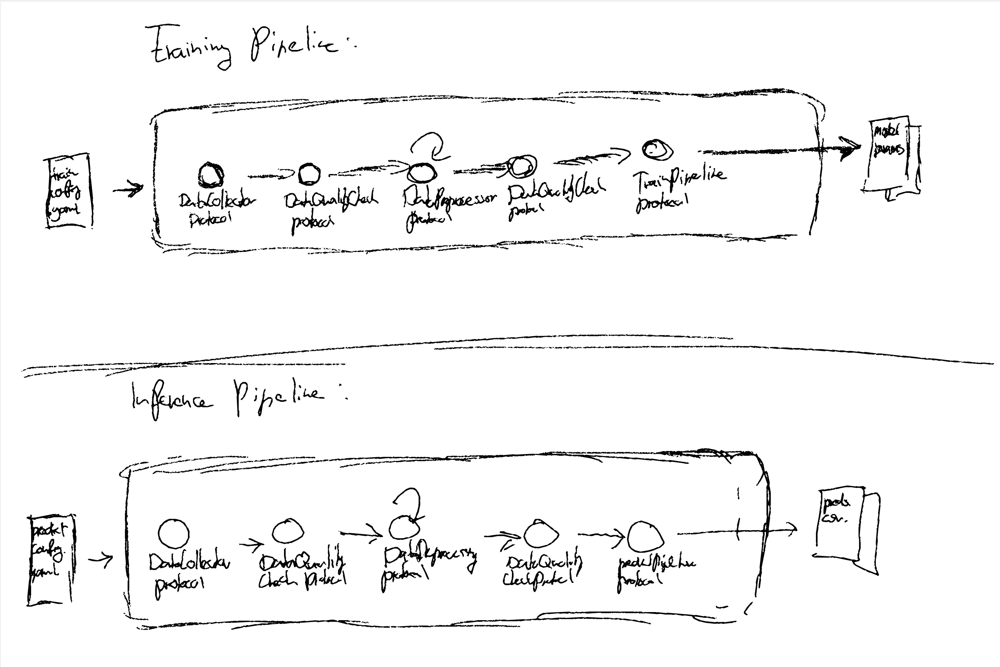

# ProML

<p align="center">
  ProML is a protocol-oriented machine learning pipeline designed to be reusable and extendable for various Big, or small, data inference tasks. 
</p>

## 📋 **Overview**
Through a [protocol-driven design](https://scotteg.github.io/protocol-oriented-programming), ProML defines the blueprint for a full machine learning pipeline from data collection to inference. Out of the box, ProML implements a binary classification task of predicting whether a product review is useful or not through supervised learning on locally stored *.csv* files using [Pyspark](https://spark.apache.org/docs/latest/api/python/index.html). However, because of its modular and protocol-driven design, ProML can easily be adapted or extended to facilitate other inference tasks, schema changes, or even completely different kinds of data sources or frameworks like [DuckDB](https://duckdb.org).

ProML tries to abstract away as much of the implementation details as possible by boiling down the machine learning pipeline to the fundamental stages of *data collection*, *data preprocessing*, *model training*, and *model inference*. Users can easily adapt or extend any of these stages by changing configuration files and without changing any source code. 

However, for users that want add new functionality, ProML also makes it easy to create new pipeline modules through the use of predefined protocols and factory methods. By ensuring new modules conform to predefined protocols, ProML can immedeatly use these new modules inside the train and inference workflows without the user needing to alter any exisiting code.


## ✅ **Features**
- ### 🔄 *Protocol-driven design*
  In contrast to most traditional Python frameworks that typically use [Abstract Base Classes](https://docs.python.org/3/library/abc.html) to define modular and reusable interfaces, ProML uses [Python Protocols](https://mypy.readthedocs.io/en/stable/protocols.html), introduced in [PEP544](https://peps.python.org/pep-0544/), to do so. This approach ensures that any component in the pipeline can be easily replaced or extended without changing the core functionality, offering a flexible foundation for future developments.

- ### 📐 *Explicit Schema Declarations*
  "Explicit is better than implicit," is part of the [Zen of Python](https://peps.python.org/pep-0020/) and something ProML strides to fulfill. By using explicitly defined schemas for incoming data, ProML avoids a whole range of bugs and facilitates straightforward adaptation to future schema changes. 

- ### ✔️ *Explicit Data Quality Checks*
  ProML employs [Great Expectations](https://docs.greatexpectations.io/docs/reference/learn/conceptual_guides/gx_overview/) to ensure that data conforms to expectations at every step of the pipeline, enhancing reliability and trustworthiness of the results.

- ### ⚙️ *Configuration-driven Training*
  ProML's training process is driven by configuration files, allowing users to easily adjust model parameters, training data sources, and other settings without modifying the code. This flexibility simplifies experimentation and tuning of models for different tasks.

- ### 🧠 *Configuration-driven Inference*
  Similar to training, the inference process is controlled by configuration files. By using a separate configuration file for inference, ProML makes it easy to use slightly different preprocessing steps for inference than for training. This comes in handy, for example, when it is warranted to drop dirty data duringn training while not so during inference.

- ### 🛠️ *Designed to Reused, Adapted, and Extended*
  The pipeline is built with adaptability and extensibility at its core, encouraging users to modify and extend it for their specific needs. Whether it's integrating new data sources, applying the pipeline to different machine learning tasks, or enhancing its capabilities with additional features, ProML is designed to support and streamline these processes.

## ⚠️ **Known Issues**
To be added as encountered and documented.

## 📦 **Requirements & Installation**

ProML uses Poetry as its dependency manager. If you do not have Poetry installed, follow [Poetry's installation instructions](https://python-poetry.org/docs/). Once you have Poetry installed, you can install the dependencies defined in *pyproject.toml* and activate the corresponding virtual environment by running the following commands:

> [!WARNING]
> MacOS users might run into problems with the Java version that comes per default on Macs. If you encounter any issues, consider downloading and installing the ARM version of Java8 at: https://www.java.com/en/download/

```bash
# install dependencies defined in pyproject.toml
poetry install
```

```bash
# activate shell
poetry shell
```

## 🚀 **Quick Start**
The quickest way to get started is to ensure you can successfully run both the default trainining and prediction modules. After having installed the dependencies and activated a Poetry shell, you can run the following commands to run both using the default conifuration:

```bash
# run the full training pipeline, from data collection to saving the model
# uses the config defined in train.yaml
python train.py
```

> [!NOTE]
> Running the prediction pipeline will fail if you have not ran the training pipeline first.
> To save resources and avoid merge conflicts, trained models are not kept under version control; hence you first need to train and save a model before you can run the prediction pipeline.

```bash
# run the prediction pipeline, using a saved model to predict unlabeled data
# uses the config defined in predict.yaml
python predict.py
```
To adapt or extend the training or prediction pipeline, you can change the *train_config.yaml* and *predict_config.yaml* files, respectively. 
> [!NOTE]
> To adapt or extend the pipeline for other inference tasks, datasources, or frameworks, you can extend or add modules to the *modules* directory. However, before doing so, we recommend reading about the ProML's architecture first.


## 🏛️ **Architecture**



ProML tries to abstract away as much of the implementation details as possible by boiling down the machine learning pipeline to the fundamental stages of *data collection*, *data preprocessing*, *model training*, and *model inference*. Users can easily adapt or extend any of these stages by changing configuration files and without changing any source code. 

However, for users that want add new functionality, ProML also makes it easy to create new pipeline modules through the use of predefined protocols and factory methods. By ensuring new modules conform to predefined protocols, ProML can immedeatly use these new modules inside the train and inference workflows without the user needing to alter any exisiting code.

## 👩🏻‍💻🧑🏽‍💻👨🏿‍💻 Handling Adapaptions & Extenions


### Handling additional data
To use additional labeled data for training, simply make sure that the data is placed under the *data/train/* directory, or the training directory specified in *train_config.yaml*. Per default, any DataCollector conforming to the DataCollectorProtocol will collect all data under the directory specified in the *train_config.yaml* file.

To do inference for additional unlabeled data, to the same, but then for the *data/predict/* directory and *predict_config.yaml* file.

### Handling schema Changes
Any DataLoader class conforming the the DataLoaderProtocol expects that there is a file called *schema.yaml*, defining the schem of the data, in the same directory as the data itself. To faciliate schema changes, simply change the schema in *schema.yaml* accordingly. In addition, you might need to add or alter expectations for the data, which are defined as expectation suites under the *gx/expectations/* directory. Finally, if column names have changes, you might also need to change the column names in the preprocessing steps of the *train_config.yaml* and *predict_config.yaml* files.

### Adding a preprocessing module to the pipeline

To add an existing preprocessing module to the pipeline, simply specify and add the configuration of the module to the *train_config.yaml* and *predict_config.yaml* files where appropiate.

>[!NOTE]
> The following section uses adding a *preprocessing module* as an example, but the steps of (1) implementing & conforming, (2) extending the factory, and (3) using the new module in a train or prediction configuration are the same for any module; just use the appropiate subdirectory and protocols accordingly.

To add a non-exsiting preprocessing module to the the pipeline, follow the following steps:

1) Implement the module under the appropiate subdirectory of the *modules/preproces/* directory (most likely the *preprocess* module) and make sure the implementation conforms the protocol defined in *modules/preprocess/PreprocessingModuleProtocol.py*.
2) Ensure the new module can be build at runtime by adding its initializer to the module factory defined in *modules/preprocess/PreprocessingModuleFactory.py."
3) Now the module is implemented and can be created at run-time, you can simply add it to the *train_config.yaml* and *predict_config.yaml* files where appropiate.

## Current Implementations
### ProMLReviewHelpfulnessClassifier


<!-- Implementing new protocols for additional functionalities.
Adding new components or models to the pipeline.
Modifying existing components to suit specific needs.
Contributing
Encourage contributions and outline how others can contribute to your project. Include:

Guidelines for submitting issues or bugs.
Instructions for proposing enhancements or new features.
The process for submitting pull requests.
License
Specify the license under which your pipeline is released, ensuring users understand how they can use or modify it. -->

<!-- ## Contact
Offer ways for users to get in touch with you for further questions or collaborations. This could include email, a project mailing list, or links to project forums. -->